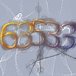

<div align="center">
  <!-- Introduction -->
  <p>
    <h1>🤖 capja</h1>
    Easy-to-use Java CAPTCHA image generation API
  </p>
  
  <!-- Badges & icons -->
  [](https://www.codefactor.io/repository/github/jonesdevelopment/capja/overview/main)
  [](https://github.com/jonesdevelopment/capja/releases)
  [](https://github.com/jonesdevelopment/capja/issues)
  [](https://jonesdev.xyz/discord)
  [](https://www.gnu.org/licenses/gpl-3.0)
  <br>
  <br>
  <!-- Quick navigation -->
  [Releases](https://github.com/jonesdevelopment/capja/releases)
  |
  [Issues](https://github.com/jonesdevelopment/capja/issues)
  |
  [Pull Requests](https://github.com/jonesdevelopment/capja/pulls)
  |
  [Discord](https://jonesdev.xyz/discord)
  |
  [License](https://github.com/jonesdevelopment/sonar/?tab=readme-ov-file#license)
</div>

## Examples

#### Generated image with default settings (24/03/2024)


#### capja being used in Minecraft as a CAPTCHA
https://youtu.be/wCXbqUubDI8

## Usage

First, you create a CAPTCHA generator:

```java
import xyz.jonesdev.captcha.CaptchaGenerator;

CaptchaGenerator generator = new CaptchaGenerator();
```

Now you can use generate a `CaptchaHolder` that holds the image and the answer to the CAPTCHA:

```java
import xyz.jonesdev.captcha.CaptchaGenerator;
import xyz.jonesdev.captcha.CaptchaHolder;

CaptchaGenerator generator = new CaptchaGenerator();
CaptchaHolder holder = generator.generate();
```

You can now retrieve the image and answer from the holder:

```java
import java.awt.image.BufferedImage;

//...
String answer = holder.getAnswer();
BufferedImage bufferedImage = holder.getImage();
```

## License

capja is licensed under the [GNU General Public License 3.0](https://www.gnu.org/licenses/gpl-3.0.en.html).

## Credits

- Special thanks to [jhlabs](<http://www.jhlabs.com/ip/filters/>) for creating awesome image filters
